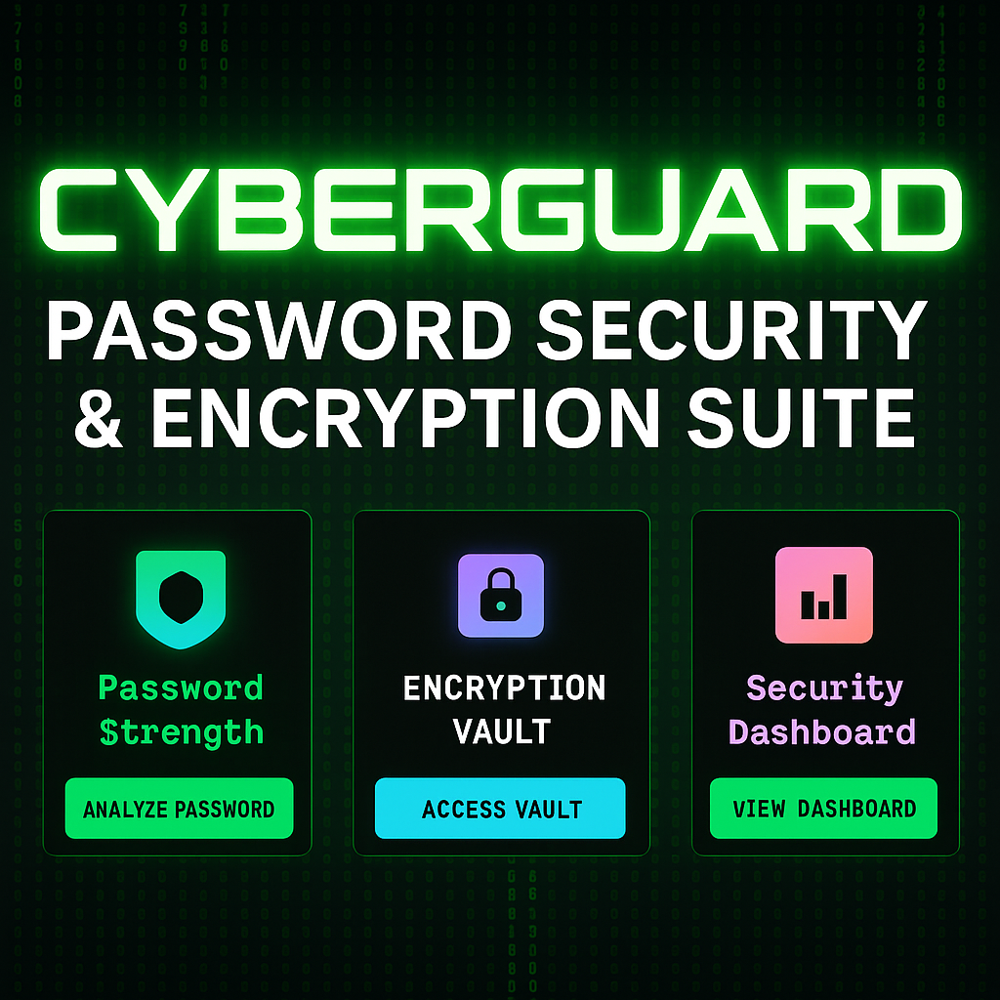

[](https://shlokkokk.github.io/cyberGuard/)

# 🔐 CyberGuard - Password Security & Encryption Suite



## 🔧 Installation

1. Clone this repository:
   ```bash
   git clone https://github.com/shlokkokk/cyberguard.git
   cd cyberguard
2. Open index.html in your browser, or serve with
   
       python -m http.server 8000

## 🌟 Features

### 🔍 Password Strength Analyzer
- Real-time password strength calculation
- Visual strength meter with color coding
- Comprehensive security criteria checking
- Entropy and crack time estimation
- Interactive radar chart visualization

## 🎯 Security Features

- **Client-side encryption**: All processing happens in your browser
- **No data transmission**: Your passwords never leave your device
- **Local storage**: Encrypted data stored locally
- **Secure algorithms**: Industry-standard encryption methods
- **Privacy first**: No tracking, no analytics, no data collection

### 🔒 Encryption Vault
- **AES-256 Encryption**: Military-grade security
- **Base64 Encoding**: Simple obfuscation
- **Custom Encryption**: XOR-based method
- Local storage for password history
- Search and filter functionality
- One-click decryption from history

### 📊 Security Dashboard
- Comprehensive security statistics
- Visual charts and progress indicators
- Personalized security recommendations
- Export functionality for data backup
- Timeline tracking of security activity

### 🎨 Cyberpunk Interface
- Matrix-style animated backgrounds
- Terminal-inspired design
- Glowing neon effects
- Cursor particle trails
- Hacker-style animations
- Responsive design for all devices

## 🚀 Technologies Used

- **Frontend**: HTML5, CSS3, JavaScript (ES6+)
- **Styling**: Tailwind CSS
- **Animations**: Anime.js, p5.js, Pixi.js
- **Encryption**: CryptoJS
- **Charts**: ECharts.js
- **Typography**: Typed.js, Splitting.js
- **Physics**: Matter.js

## 📱 Usage

1. **Analyze Passwords**: Check the strength of your existing passwords
2. **Encrypt Passwords**: Securely store passwords with encryption
3. **Monitor Security**: Track your overall security status
4. **Export Data**: Backup your encrypted password history

